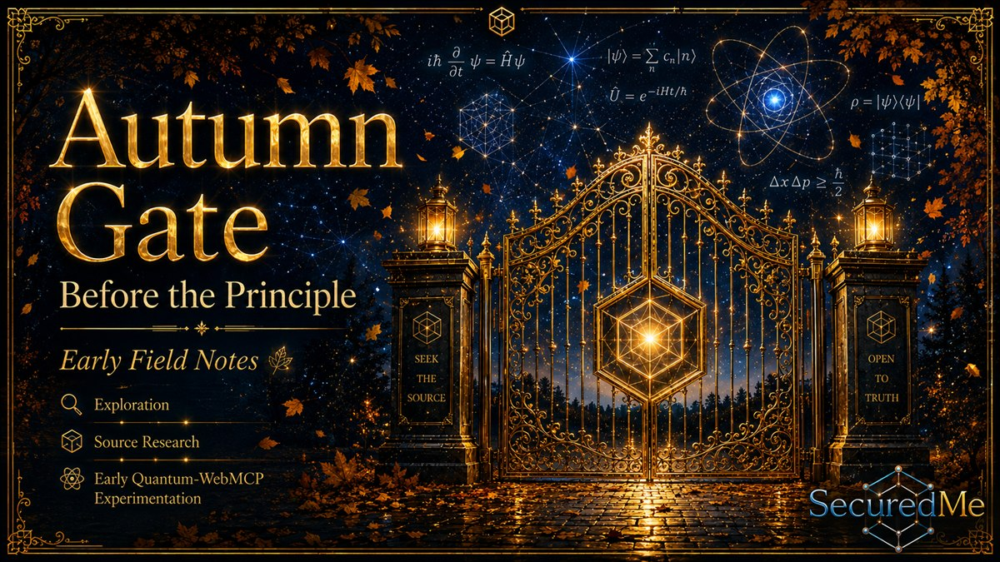
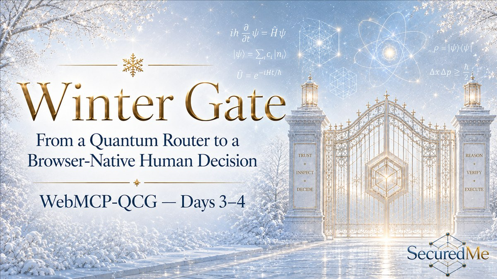

# WebMCP-QCG: Quantum Call Gate

<p align="center">
  
</p>
<p align="center">
  <a href="https://doi.org/10.5281/zenodo.22240306">
    
  </a>
</p>

> **Software DOI reserved — publication pending final release QA.**

**Review before you run. Decide before quantum execution.**

WebMCP-QCG is a browser-native, human-in-the-loop quantum preflight workbench.
It inspects bounded evidence, recommends one of five outcomes, records an
explicit human decision, can simulate only the canonical Q# and OpenQASM Bell
programs locally, and exports a reproducible evidence receipt. It never submits
a QPU or provider job.

[Live application](https://qcg.securedme.ca/) ·
[Vercel design preview — older build](https://webmcp-qcg.vercel.app/) ·
[Devpost project](https://devpost.com/software/webmcp-qcg-quantum-call-gate) ·
[MIT license](LICENSE)

The Devpost page is public. Hackathon submission remains under Jean-Sébastien
Beaulieu's explicit control.

## Four seasons of one build

The seasons tell the engineering story. They are editorial chapters, not
runtime themes. The product exposes only **Dark** and **Light**.

| Autumn — choose | Winter — bound |
| --- | --- |
|  |  |
| The broad router idea became one browser-native call gate with explicit non-goals. [Decision trail](docs/decisions/2026-08-27-initial-portfolio.md). [Article DOI 10.5281/zenodo.22135277](https://doi.org/10.5281/zenodo.22135277). | Tool contracts, evidence receipts and five deterministic recommendations turned ambition into inspectable states. [Architecture decision](docs/decisions/2026-08-29-browser-native-hitl-quantum-preflight-workbench.md). Reserved article DOI: [10.5281/zenodo.22167091](https://doi.org/10.5281/zenodo.22167091). |

| Spring — prove | Summer — converge |
| --- | --- |
|  |  |
| Feature expansion stopped. Q#, OpenQASM, accessibility, benchmarks and release gates became the work. [Feature-freeze decision](docs/decisions/2026-08-30-day5-spring-proof-and-feature-freeze.md). [Article DOI 10.5281/zenodo.22211182](https://doi.org/10.5281/zenodo.22211182). | Web, F12 and Companion converge around sanitized state while the human remains the decision holder. [Day 7 public trace](research/day7/DAY7_PUBLIC_SAFE_TRACE_2026-09-01.md). Reserved article DOI: [10.5281/zenodo.22240281](https://doi.org/10.5281/zenodo.22240281). |

## The decision path

```text
import → inspect → evaluate → human decision
       → optional bounded Bell simulation → export evidence
```

1. A human imports a UTF-8 artifact of at most 128 KiB and selects its profile,
   or opens one of five falsifiable demonstration cards.
2. QCG hashes the exact bytes and creates a versioned artifact manifest with
   bounded compiler evidence.
3. QCG evaluates the intent, observable, request limits and one frozen target
   profile.
4. It returns exactly one recommendation:
   `reuse_result`, `reject`, `recompile`, `simulate_first`, or
   `ready_for_external_execution`.
5. A human accepts, defers or overrides. An override requires a justification.
6. An accepted `simulate_first` recommendation can create one short-lived,
   single-use consent token for the checked-in local Bell fixture.
7. QCG exports JSON or Markdown evidence without raw source, credentials,
   provider diagnostics, consent tokens or local filesystem paths.

`ready_for_external_execution` is a preflight result. It is never provider
authorization, a QPU submission or permission to spend money.

## One bounded state, three browser surfaces

| Surface | Current responsibility | Authority boundary |
| --- | --- | --- |
| **Web application** | Import, inspect, evaluate, record the human decision, run an approved bounded local fixture and export evidence. | The only surface that can hold consent or trigger simulation. |
| **QCG F12 panel** | Render sanitized manifest, recommendation, activity, participants and review requests for the inspected page. | Optional unpacked extension; no source, consent or simulation command crosses it. |
| **QCG Companion side panel** | Keep bounded context visible beside the active QCG tab and support structured human/agent handoffs. | Uses declared participants rather than authenticated agent identities. |

The canonical Web application is public. The F12 and side-panel surfaces are an
optional unpacked Manifest V3 Companion. Current evidence proves the Companion
opening on the canonical Chrome origin. The final retained-tab F12 sequence is
one of the release gates for the last coding and recording pass.

Gemini in DevTools remains a manual, inspectable relay:

```text
QCG sanitized export → human copy/paste → Gemini response
                     → human preview → schema-validated import
```

QCG does not claim a private Gemini API or direct access to Gemini's native
conversation.

## Eight tools, two responsibilities

### Quantum-facing WebMCP tools

| Tool | Availability | Bounded effect |
| --- | --- | --- |
| `inspect_quantum_experiment` | After a valid human-loaded manifest exists | Returns the bounded artifact manifest. Raw source never crosses the contract. |
| `evaluate_quantum_call` | After a valid manifest exists | Returns one recommendation, reason codes, unknowns, confidence and a safer alternative. |
| `run_bounded_local_simulation` | Only after valid `simulate_first` evaluation and live one-use human consent | Runs the approved Q# or OpenQASM Bell fixture locally in a Worker. |
| `export_quantum_evidence_report` | After evaluation creates a receipt | Exports JSON or Markdown without re-evaluating or executing. |

### Collaboration tools registered by the QCG page

| Tool | Purpose |
| --- | --- |
| `read_debug_context` | Read a bounded, sanitized collaboration snapshot. |
| `post_debug_message` | Add a structured observation, hypothesis, proposal or challenge. |
| `request_human_review` | Ask the human decision holder to review a bounded question. |
| `export_debug_handoff` | Export a sanitized packet for another participant or manual Gemini relay. |

The page registers collaboration tools through `devtoolstooldiscovery`. The
extension renders and transports bounded state. Collaboration tools cannot
accept a recommendation, create consent, run simulation or authorize an
external effect.

## Quantum profiles

| Capability | Profiles |
| --- | --- |
| **Bounded local fixture execution** | Q# through QDK; OpenQASM through the same pinned QDK WebAssembly runtime. |
| **Static inspection only** | Qiskit Python, Cirq/TFQ Python, TorchQuantum Python, PennyLane Python, CUDA-Q Python, CUDA-Q C++, Braket Python and QIR text. |

Only the canonical programs represented by the checked-in
[`qcg-bell-sample.qs`](prototype/webmcp-qcg/public/fixtures/qcg-bell-sample.qs)
and
[`qcg-bell-sample.qasm`](prototype/webmcp-qcg/public/fixtures/qcg-bell-sample.qasm)
fixtures can reach local simulation. QCG normalizes line endings, trailing
spaces and empty lines for this fixture identity check while preserving the
exact imported-byte digest in evidence. Arbitrary programs receive inspection
and bounded compiler evidence; they do not become executable through QCG.

## Quick start

From the repository root:

```powershell
Set-Location prototype/webmcp-qcg
npm ci
npm test
npm run build
npm run dev
```

Open the URL printed by Vite. The human interface remains usable when WebMCP is
unavailable.

Optional WebMCP evaluations:

```powershell
npm run eval:smoke
npm run eval:live
```

### Optional QCG Companion

Validate the unpacked extension:

```powershell
Set-Location companion/qcg-devtools-extension
npm test
```

Then open `chrome://extensions`, enable Developer mode, select **Load unpacked**
and choose `companion/qcg-devtools-extension/`. The production manifest is
restricted to `https://qcg.securedme.ca/*`; localhost requires the separate
development manifest workflow described in the
[Companion README](companion/qcg-devtools-extension/README.md).

The extension has no dependency installation or build step.

## Verification snapshot

Current final-pass verification on 2026-09-01:

- the canonical cPanel URL returns HTTP 200 and serves the byte-verified final
  bundle; the Vercel design preview also returns HTTP 200 but remains on an
  earlier bundle and is not the release authority;
- TypeScript and Vite production build pass;
- current application bundle: 131 modules, 378.53 kB JavaScript and 14.38 kB
  CSS, with QDK WebAssembly tracked separately;
- 61 Vitest cases pass across 10 test files;
- QCG Companion v0.2.4 manifest, trusted-click, strict snapshot lifecycle and
  low-glare Light-theme tests pass;
- real Chrome browser routes for imported Q# and OpenQASM both reached
  `simulate_first`, a declared human acceptance, a 64-shot local Bell result,
  evidence export and zero QPU submissions;
- the retained-tab Companion/F12 proof remains a final release gate after the
  unpacked extension is reloaded to v0.2.4;
- the public repository is licensed under MIT.

The repository records deterministic benchmark evidence separately from HTTP
delivery evidence. The final cPanel package, public hashes, security headers
and rollback boundary are captured in the
[deployment receipt](docs/evidence/QCG_FINAL_CPANEL_DEPLOYMENT_RECEIPT_2026-09-01.md).

## Security and deliberate limits

- No QPU call, provider job, provider credential, payment or remote quantum
  execution exists in this release.
- The QPU submission counter is structurally fixed at zero.
- Source code, private paths, consent tokens, secrets, internal stacks and raw
  network bodies are excluded from exported contracts.
- Agent identities are declared, not cryptographically authenticated.
- Human decisions are bound to the active session and recommendation.
- Simulation remains website-only and consumes one-use local consent.
- Static profiles cannot return `simulate_first` or
  `ready_for_external_execution`.
- The access panel improves direct-use preferences; it does not claim WCAG
  certification or replace assistive technology.
- Chrome is the verified Companion runtime. Edge support remains a compatibility
  target until a dedicated runtime receipt exists.

See the [threat model](docs/security/QCG_THREAT_MODEL.md) for the complete trust
boundaries and residual risks.

## Evidence and design trail

- [Console design contract](docs/design/qcg-console-redesign/DESIGN.md)
- [DevTools multi-agent runbook](docs/DEVTOOLS_MULTI_AGENT_RUNBOOK.md)
- [Release runbook](docs/RELEASE.md)
- [Architecture decisions](docs/decisions/)
- [Machine-readable evidence](evidence/)
- [Day 7 Companion and A2A trace](research/day7/COMPANION_A2A_AND_LOW_GLARE_TRACE_2026-09-01.md)
- [Video, A2A and README status](research/day7/DAY7_VIDEO_A2A_README_STATUS_2026-09-01.md)
- [Summer 9/39 source register](research/day7/SUMMER_9_39_SOURCE_REGISTER_2026-09-01.md)

## Citation and release state

- Software release: `v0.1.0-hackathon`
- Evidence schema: `webmcp-qcg.evidence-receipt.v3`
- Reserved software DOI: [10.5281/zenodo.22240306](https://doi.org/10.5281/zenodo.22240306)
- License: [MIT](LICENSE)

The software DOI is reserved. The Zenodo software record, release tag and
source archive will be published only after the final code, clean-clone QA and
Jean-Sébastien's approval. The four editorial articles retain their independent
publication records.

## Governance

- Public construction is not a Devpost submission.
- AI agents may inspect, propose, challenge and explain. They never replace
  explicit human authority.
- Deterministic quantum libraries perform compilation and local simulation; an
  AI agent does not manufacture quantum results.
- No secret, provider credential, private correspondence or private filesystem
  path belongs in this repository or an exported receipt.
