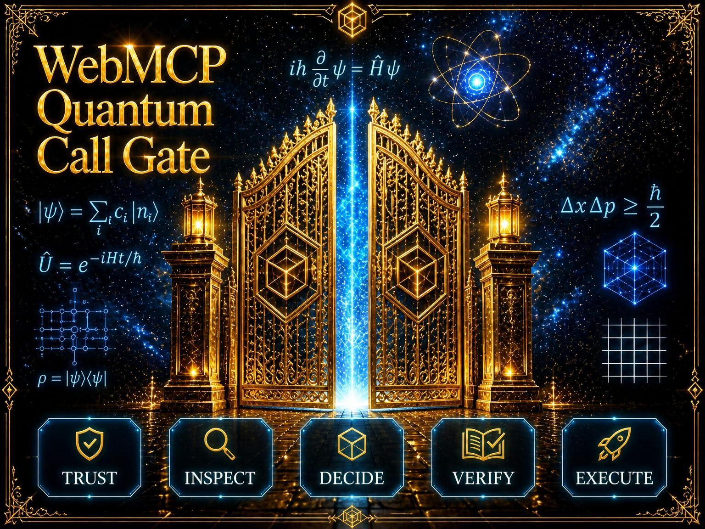

# WebMCP Quantum Call Gate

**QCG v2** is a working browser prototype for one decision that should happen
before quantum execution: reuse existing evidence, reject the request, recompile,
simulate locally first, or report that the request is ready for a separately
authorized external system.

It is a human-in-the-loop preflight workbench, not a quantum provider. The
prototype imports a local Q# artifact, derives a byte-exact manifest, evaluates
it against a time-bounded target-profile snapshot, records the human decision,
and exports a reproducible v2 evidence receipt. Only the published Bell program
(allowing leading or trailing whitespace) can enter the bounded local simulation
path.

- Stable release URL: [https://qcg.securedme.ca/](https://qcg.securedme.ca/)
- Current public status: the retained HTTPS origin serves QCG directly. The
  2026-08-29 live-origin run passed its byte-integrity, header, WASM MIME,
  human fallback and native WebMCP smoke gates.
- License: [MIT](LICENSE). Dependency licenses remain with their authors; see
  [THIRD_PARTY_NOTICES.md](THIRD_PARTY_NOTICES.md).

No QPU submission, paid API, provider credential, or remote quantum job exists
in this MVP. The QPU submission counter is structurally fixed at zero.

## What QCG v2 actually does

1. A human imports a UTF-8 `.qs` file of at most 128 KiB, or selects one of five
   falsifiable demo cards.
2. QCG computes a SHA-256 digest of the exact bytes and creates a
   `webmcp-qcg.artifact-manifest.v2` manifest with bounded compiler evidence.
3. QCG evaluates scientific intent, observable, requested limits, and one
   frozen target profile. The result is one of five explicit decisions.
4. A human accepts, defers, or overrides the recommendation. An override needs
   a justification. Only an accepted `simulate_first` recommendation creates
   short-lived, one-use consent for local simulation.
5. The pinned `qsharp-lang@1.31.0` runtime can execute the published Bell sample
   in a Web Worker. The receipt records effects and keeps QPU submissions at 0.
6. JSON or Markdown evidence can be exported without raw Q#, credentials,
   provider diagnostics, or local filesystem paths. Receipts are also stored
   locally in browser IndexedDB when it is available.

## Quick start

From the repository root:

```bash
cd prototype/webmcp-qcg
npm ci
npm test
npm run build
npm run dev
```

Open the local URL printed by Vite. The human interface works without WebMCP.
For the exact setup, sample path, browser modes, and troubleshooting, use the
[getting-started guide](docs/GETTING_STARTED.md).

The checked-in Q# sample is
[`prototype/webmcp-qcg/public/fixtures/qcg-bell-sample.qs`](prototype/webmcp-qcg/public/fixtures/qcg-bell-sample.qs).
While Vite is running, the same file is served at
`/fixtures/qcg-bell-sample.qs`.

## Four progressive WebMCP tools

The tools are registered dynamically. A clean page exposes no artifact tool;
the first two appear only after the human has loaded a valid local artifact.

| Tool | When it is available | Effect |
|---|---|---|
| `inspect_quantum_experiment` | After a human-loaded artifact manifest exists | Verifies the artifact identifier and returns its bounded manifest. Raw Q# does not cross the tool contract. |
| `evaluate_quantum_call` | After a human-loaded artifact manifest exists | Returns one recommendation, reason codes, unknowns, confidence, and a safer alternative. It grants no execution authority. |
| `run_bounded_qsharp_simulation` | Only while a valid `simulate_first` recommendation has accepted, unused human consent | Consumes consent and runs the approved Bell sample locally in a Worker. It makes no provider or QPU call. |
| `export_quantum_evidence_report` | After an evaluation has created a v2 receipt | Exports the current receipt as JSON or Markdown without re-evaluating or executing it. |

An evaluation normally makes the export tool discoverable immediately. The
simulation tool appears only for the narrower consented branch and disappears
after its one-use consent is consumed.

## Browser modes

- **Human controls:** available in an ordinary modern browser; native tool
  discovery is optional.
- **WebMCP-capable in-app browser:** native tools are available when the page
  receives `document.modelContext.registerTool`.
- **Experimental Chrome WebMCP testing:** use a Chrome build that exposes
  `chrome://flags/#enable-webmcp-testing`, enable the flag, and fully restart
  Chrome. Flag availability is browser-build dependent.

If the WebMCP API is absent or registration fails, QCG reports that state and
keeps the human workflow usable.

## Current verification

The current QCG v2 working tree was rechecked on 2026-08-29 in an isolated copy
with Node.js `24.18.1` and npm `11.16.0`:

- clean `npm ci`: pass, 0 vulnerabilities reported;
- automated test files: 2 passed;
- automated tests: 18 passed;
- TypeScript check and Vite production build: pass;
- development server and `/fixtures/qcg-bell-sample.qs`: HTTP 200.

The earlier native browser/Q# vertical-slice receipt remains useful historical
evidence, but it does not replace a fresh stable-origin Chrome run for QCG v2.
See [`evidence/qa/`](evidence/qa/) for dated receipts.

## Limits and non-goals

- QCG v2 accepts Q# only. It is not a universal circuit language, converter, or
  multi-provider router.
- Imported Q# can be inspected and evaluated, but local execution is deliberately
  limited to the published Bell program, allowing leading or trailing whitespace.
- The request bounds are at most 256 shots, 8 qubits, and 15 seconds. They bound
  input and policy; they are not generalized capacity or performance claims.
- `ready_for_external_execution` means only that the recorded preflight found no
  blocker under the supplied snapshot. Provider availability, credentials,
  queue state, price, submission, and authorization remain unknown and external.
- Bundled target profiles expire. A stale or unknown profile is rejected rather
  than treated as current evidence.
- IndexedDB receipts are local to the browser profile; there is no account,
  server sync, analytics, or remote persistence.
- Stable-origin evidence is recorded in the
  [live acceptance receipt](evidence/qa/LIVE_ORIGIN_ACCEPTANCE_RECEIPT_2026-08-29.md).
  Future builds must repeat those gates before replacing this release.

## Documentation map

- [Getting started](docs/GETTING_STARTED.md) — install, test, build, run, sample,
  browser setup, workflow, and troubleshooting.
- [Release runbook](docs/RELEASE.md) — release artifact, gates, required headers,
  stable-origin validation, rollback boundary, and open blockers.
- [Threat model](docs/security/QCG_THREAT_MODEL.md) — assets, trust boundaries,
  controls, residual risks, security headers, and deliberate exclusions.
- [`docs/PROJECT_CHARTER.md`](docs/PROJECT_CHARTER.md) — scope and non-goals.
- [`docs/decisions/`](docs/decisions/) — dated architecture decisions.
- [`docs/hackathon-build/`](docs/hackathon-build/) — specification, checklist,
  build notes, and current action registry.
- [`evidence/`](evidence/) — machine-readable receipts and provenance.
- [`evidence/hosting/`](evidence/hosting/) — current read-only hosting baseline.
- [`docs/journal/`](docs/journal/) — public development journal.

## Governance

- Public construction is not a Devpost submission.
- No QPU, paid API, provider job, or spending action is authorized by QCG.
- Deterministic quantum libraries perform compilation and simulation; an AI
  agent may orchestrate and explain but does not manufacture quantum results.
- No secret, provider credential, private path, Origin Trial token, or private
  correspondence belongs in the repository or an exported receipt.
