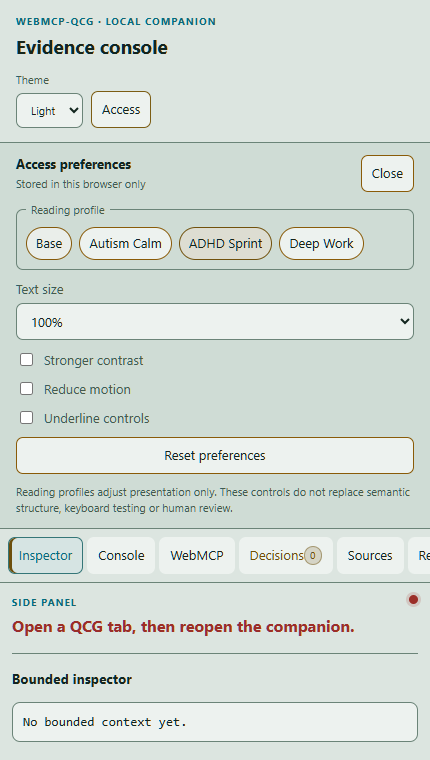
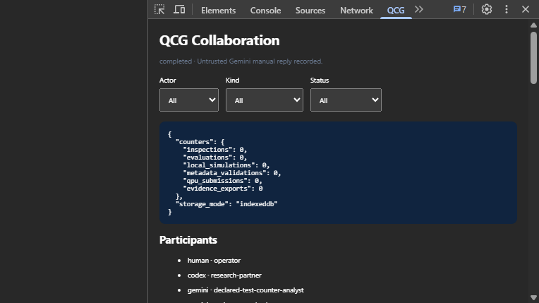

# Install QCG Console Companion 0.2.4

QCG works without this optional extension. Install Companion only when you want
the synchronized Chrome side panel and the QCG panel in DevTools.

## Before you start

You need desktop Google Chrome and either the extracted Companion ZIP or this
repository folder. “Load unpacked” means choosing a folder, not choosing the ZIP
file itself. Keep that folder in place while the extension is installed.

## Install in Chrome

1. If you downloaded a ZIP, right-click it, select **Extract All**, and open the
   extracted folder. Confirm that `manifest.json` is directly inside the folder
   you will choose.
2. Enter `chrome://extensions` in Chrome's address bar.
3. Turn on **Developer mode** in the upper-right corner.
4. Select **Load unpacked**.
5. Choose the folder containing `manifest.json`. From a repository checkout,
   that folder is `companion/qcg-devtools-extension/`.
6. Confirm that **QCG Console Companion** appears on the extensions page and is
   enabled. Chrome displays any manifest error on this card; resolve it before
   continuing.
7. Open <https://qcg.securedme.ca/> or return to its tab, then reload once so the
   newly installed content bridge attaches to the page.

## Open the two Companion views

- On the QCG page, select **Open Companion**. The Chrome side panel should open
  beside the same tab. Selecting the control again closes it.
- To open the developer view, press `F12` (or `Ctrl+Shift+I`), select the **QCG**
  tab in DevTools, and keep DevTools attached to the QCG page.

The first image is the verified Light/Access side-panel result. The second is an
existing repository capture of the QCG DevTools panel; they illustrate the
expected surfaces, not the Chrome installation dialog.

## If the panel says it is waiting

1. Confirm that the active tab is exactly `https://qcg.securedme.ca/` or a page
   below that origin.
2. Reload the QCG page after installing or reloading the extension.
3. In `chrome://extensions`, select the reload icon on the Companion card, then
   reload the QCG page again.
4. Close and reopen the side panel or DevTools. The current bridge reconnects
   after page reload, navigation and extension-worker suspension; stale state is
   cleared when a fresh tab/session cannot be established.
5. If Chrome reports a manifest error, remove the extension and repeat the
   install using the folder that directly contains `manifest.json`.

Removing the extension from `chrome://extensions` removes the Companion. QCG's
Web interface continues to work without it.

The production package is restricted to `https://qcg.securedme.ca/*`. It does
not contain a provider credential, QPU integration, remote execution path or
automatic installer. Chrome requires the final **Load unpacked** action to be
performed by the person using the browser.

For local development at port 5173, use the separately generated development
archive. The public judge-facing download intentionally omits localhost access.
